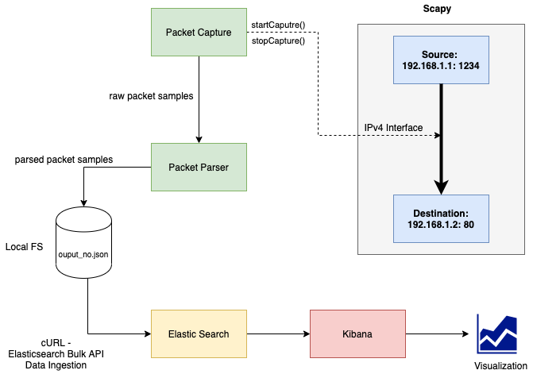
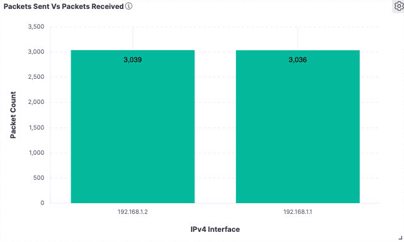
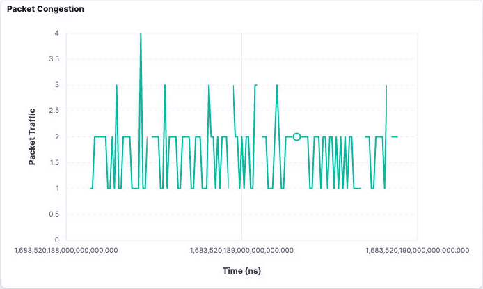

## Simple Packet Analyzer Tool

Built for an internship test task @ Aviz Networks.

### Problem Statement:

Capture packet samples from devices (eg: switch, router or linux server), prepare metadata and trouble shoot application latencies.


### Solution Architecture



### Overview

- **Network Module:** Uses a simple python script to simulate traffic between two ipAddresses via Scapy - an interactive packet manipulation libary.

- **Packet Capture Module**: Uses [PCapPlusPlus](https://github.com/seladb/PcapPlusPlus), a C++ wrapper to sample network packets received by the client using an ipv4Interface device. The samples are collected via asynchronous packet capture using a packet list vector (RawPacketVector) for 10seconds.
  
- **Packet Parser Module:** This is used by the Packet Parser (also uses PCapPlusPlus) to parse the network packets, collect the metadata that is of interest to us in a PacketMetaData structure.
  - 3 metrics of interest were identified as - **Packet Loss, Packet Retransmission count, Network congestion.**
  - Packet loss is computed as the difference is number of packets noticed from the source to destination ip/ports.
  - Network congestion is computed as the packets received at the client ip/port aggregated over granular intervals of time.
  - Packet Re-transmission count has not been implemented since the sequenceNumber field is not populated from the packet parser  - havent had time for a fix.

- Overall the following packet level level metrics are collected
  - SampleID, TimeStamps, SourceIP, DestinationIP, Packet Payload Size, Ports, Sequence Number, ACK Number, Window Size

- And the following sample level (for every sample captured - once every 2 seconds for 5 times):
  - uniqueSampleId, sampleSize, ipv4Interface, macAddress

- **Data Storage and Format:** This data is stringified and stored in a JSON file.
  - For now, the since sampling is done at regular intervals for 5 counts - 5 files are generated.
  - The data is stored in a format ideal for elastic bulk API. There are header and data entries that look as follows
    ```
    # sample-1-header (out of 5)
    {"index": {"_index": "pcap_2023-05-08", "_id": ""}}
    {"recordType":"H","timestamp":1683529075359516000,"sampleId":1683529075359516000,"sampleSize":1285,"interfaceName":"en0","interfaceDesc":"","macAddress":"d0:81:7a:b1:5e:1e","defaultGateway":"192.168.1.1"}

    # sample-1-data-row-1 (out of 1000s)
    {"index": {"_index": "pcap_2023-05-08"}}
    {"recordType":"D","timestamp":1683529075359516000,"sampleId":1683529075359516000,"sourceIP":"192.168.1.1","destIP":"192.168.1.2","packetSize":67,"seqNo":0,"ackNo":0,"windowSizeInt":8192,"sourcePort":1234,"destnPort":80}
    ```

  - Each packet data is indexed by time (timestamp+uniqueId) in nano seconds using chrono.


- **Elasticsearch and Kibana:** These 5 files are for now ingested into Elasticsearch via manually calling the Bulk API from the terminal (using cURL).
```
curl --cacert http_ca.crt -XPOST -u elastic:******** -H 'Content-Type: application/x-ndjson' 'https://localhost:9200/_bulk' --data-binary @<output_number>.json
```
- Elasticsearch Bulk API is used push this data into Elasticsearch and the data is used to create simple visualizations in Kibana (Both are setup in a docker network).

- **Unit Tests:** Minimal unit tests have been written with googletest framework for C++ testing for network interface device handling and packet parsing modules.

### Visualizations




### Another approach

I also considered calculating metrics of packets from the source to destination by writing the transmitted packets periodically to .pcap files at source and comparing it with samples at the destination at even intervals and sample times. I however did not implement a version of this due to the sequenceNumber and time constraints.

I realize that there is room for improvement which I was unable to implement given the time constraints such as sampling at regular intervals indefinitely, configurable sample velocity and automated elasticsearch data ingestion. 